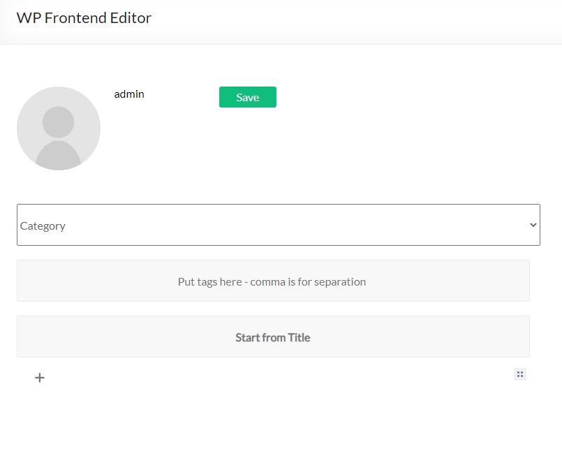

# alshc_frontend_edit
wordpress frontend editor plugin

== Description ==

This plugin add frontend editor to your web-site. The plugin is easy to use. Please create empty page for editor, put shortcode [alshc_post_editor] on the created page.
Click to "WP FRONTEND PUBLISH EDITOR" menu in admin console. Follow to the instructions: set users capabilities and select the created page.

== Installation ==

1. Upload plugin folder to the `/wp-content/plugins/` directory
2. Activate the plugin through the 'Plugins' menu in WordPress
3. Create a page for Editor 
4. Put shortcode [alshc_post_editor] on the created page 
5. Open setting page in admin console - "WP FRONTEND PUBLISH EDITOR"
6. Follow to instructions:
6.1. Select the created page as Editor page
6.2. Cet users capabilities
7. Enjoy!

== Screenshots ==

1. Frontend editor page view

2. Frontend editor add new block

3. Frontend editor change block features

4. Backend editor menu item

5. Backend editor manual

6. Backend editor page selection

7. Backend editor user capabilities 
